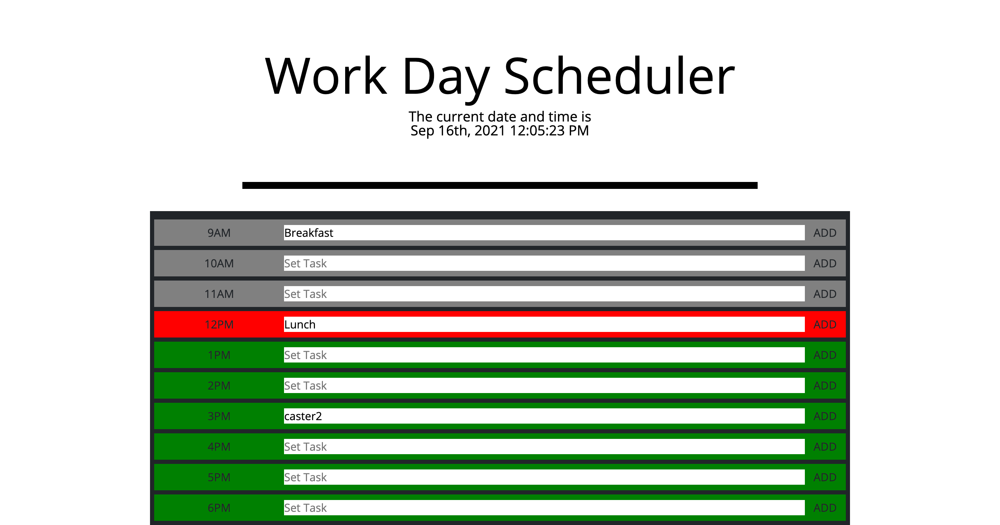
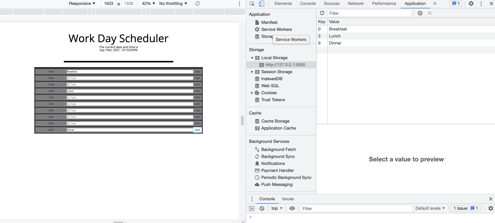

# Cynosure

## Description
    For this project I needed to create a functioning daily calendar with the ability to save data to the local storage. This will be good for keeping track of important events throughout a workday. With this project i was able to generate multiple boxes with jQuery as well as how to set time with moment.js. 

## Installation
To install this program go to https://github.com/Jahbeezy/Cynosure then click the green button and copy the SSH key to clone it to your computer.

## Usage
    Once you've opened up the application you can now enter a task at whichever hour available then click 'add' to add it to the localStorage. The current time and date is displayed at the top under the jumbotron. The background color of each box changes depending on if the time is before the current time (grey), ahead (green), and the current time(red).

## Credits

Carlos Hernandez

https://developer.mozilla.org/en-US/

https://www.w3schools.com/

https://api.jquery.com/

https://momentjs.com/

## Liscence
    MIT License

    Copyright (c) [year] [fullname]

    Permission is hereby granted, free of charge, to any person obtaining a copy
    of this software and associated documentation files (the "Software"), to deal
    in the Software without restriction, including without limitation the rights
    to use, copy, modify, merge, publish, distribute, sublicense, and/or sell
    copies of the Software, and to permit persons to whom the Software is
    furnished to do so, subject to the following conditions:

    The above copyright notice and this permission notice shall be included in all
    copies or substantial portions of the Software.

    THE SOFTWARE IS PROVIDED "AS IS", WITHOUT WARRANTY OF ANY KIND, EXPRESS OR
    IMPLIED, INCLUDING BUT NOT LIMITED TO THE WARRANTIES OF MERCHANTABILITY,
    FITNESS FOR A PARTICULAR PURPOSE AND NONINFRINGEMENT. IN NO EVENT SHALL THE
    AUTHORS OR COPYRIGHT HOLDERS BE LIABLE FOR ANY CLAIM, DAMAGES OR OTHER
    LIABILITY, WHETHER IN AN ACTION OF CONTRACT, TORT OR OTHERWISE, ARISING FROM,
    OUT OF OR IN CONNECTION WITH THE SOFTWARE OR THE USE OR OTHER DEALINGS IN THE
    SOFTWARE.